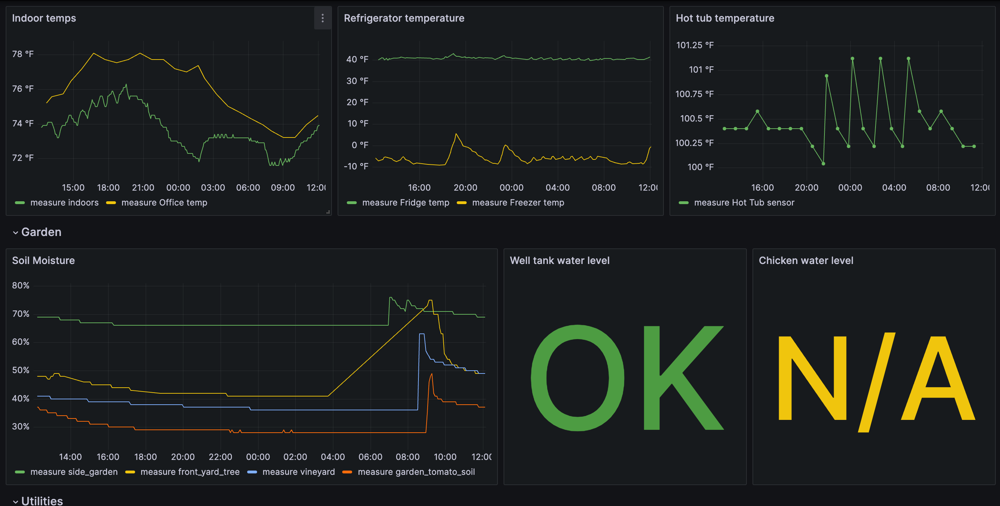

# Home Monitoring

This is a personal project that monitors, visualizes and alerts on data from IOT sensors around my
home. In particular, it monitors things like:

- Soil moisture at various points in the yard to ensure irrigation is functioning correctly
- Temperature sensors for hot tub/pool, refrigerators, indoors, etc
- Water levels of our well tank and chicken waterer
- Household water usage
- Solar production
- Number of chicken eggs laid

The service runs on AWS as a set of Lambda functions that scrape IOT APIs and write to AWS
Timestream and DynamoDB databases. An ephemeral Grafana server and some dynamic HTML pages provide
data visualizations.

## Screenshots


*Grafana chicken monitoring*


*Grafana temp and soil monitoring*


*Latest egg detector results*

## Deployment


### Infrastructure configuration

Most infrastructure runs on AWS and is configured via Terraform. We run nearly
identical copies of the service across dev and production environments. Each
environment is contained in a separate AWS sub-account under a parent organization.

- [See the account_base module README](terraform_modules/account_base/README.md)
  for instructions on bootstrapping the AWS accounts
- Pay special attention to the local `~/.aws/credentials` configuration
- In both the dev and prod Terraform environments, copy the `config.tfvars.template`
  file as `config.tfvars` and fill in the variables

After the accounts and TF state backend are configured via the steps above, run:

```
make tf-init
make tf-apply-dev
make tf-apply-prod
```

### Secrets

`home-monitoring` integrates with numerous third party IOT APIs. All required secrets
must be configured in:

- `home_monitoring/secrets.py`
- `egg-detector/egg_detector/secrets.py`
- `terraform_modules/grafana/secrets.tf`

These files are .gitignore'd, of course. You'll find template files to copy alongside the
files mentioned above.

#### Setting up Enphase API keys

Enphase (solar production monitoring) has a more complicated authorization process that requires a
homeowner authorization step before generating the initial access/refresh tokens. It also has a more
aggressive token expiration policy. We have a `home_monitoring.lambdas.auth_token_refresher` in
place to handle the latter, but the homeowner auth step is currently manual.

When creating a new environment or if tokens ever expire, we'll need to regenerate access/refresh
tokens by running the following interactive script in the virtual environment with ENV=`dev`|`prod`:

```
python -m home_monitoring.scrapers.auth_token_fetcher [ENV]
```

### App configuration

Given this is a personal project, minimal effort has been put into extending the
application to different IOT devices, deployments and configurations. Most of the hard-coded
configuration values have been extracted to [home_monitoring/config.py](home_monitoring/config.py).
Beyond that, the [default Grafana dashboard](dashboards/main_dashboard.json)
and [monitoring config](home_monitoring/monitoring/configs.py) also
contain references to specific devices.

### AWS deployment

Execute the following targets to run unit tests, build the Docker image, upload to ECR and update
all Lambda functions to point to the new images:

```
make deploy-dev
make deploy-prod
```

### On-premise server configuration and deployment

We run two on-premise jobs: ping monitoring and chicken egg detection. These are run
on a snowflake Ubuntu 20 server. The abbreviated steps to setting up this machine are
as follows:

- Zip up, scp and expand the entire `home-monitoring` project into `~/home-monitoring`
- Run the `make deploy` target in `egg-detector/Makefile` to copy the egg detector Docker image*
- Create an IAM user named `on_prem_user` in prod (no console access) with
  the `home_monitoring_function` policy
- Copy access/secret key to `~/.aws/credentials`
- Change server time to UTC
- Dump the contents of `etc/crontab` into `crontab -e` to set up daemons (test the target locally
  first)

*Note: due to unresolvable library conflicts (see [README](egg-detector/README.md)),
`egg-detector` is built and deployed to the on-premise machine as a separate app.

## Monitoring

The following monitoring/alerting is configured out of the box:

- continuous monitoring of IOT metrics and alerts based on
  [configured thresholds](home_monitoring/monitoring/configs.py). This monitoring
  is disabled in dev by default
- simple CloudWatch alarms on Lambda errors
- a simple [CloudWatch dashboard](terraform_modules/lambdas/dashboards.tf)
  for viewing lambda errors by function name

## Development

### Python setup

The app is built with Python 3.11. `pyenv` greatly simplifies installing/managing multiple versions
of Python.

### Unit tests

Unit tests provide basic coverage of most functionality. To run for `home-monitoring`:

```
make test
```

Tests for `egg-detector` are run in Docker:

```
cd egg-detector
make test
```

### Local integration testing

Integration-style tests are run manually. Some modules have `__main__` code blocks to facilitate
local testing. The virtual environment is set up as a prerequisite to `make test`.

To run integration tests for scraper lambda code, run `make docker-run`. Then, in another terminal,
run any of:

```
curl -XPOST "http://localhost:9000/2015-03-31/functions/function/invocations" -d '{"scraper_class": "home_monitoring.scrapers.ecowitt.EcowittScraper"}'
curl -XPOST "http://localhost:9000/2015-03-31/functions/function/invocations" -d '{"scraper_class": "home_monitoring.scrapers.yolink.YolinkScraper"}'
curl -XPOST "http://localhost:9000/2015-03-31/functions/function/invocations" -d '{"scraper_class": "home_monitoring.scrapers.flume.FlumeScraper"}'
curl -XPOST "http://localhost:9000/2015-03-31/functions/function/invocations" -d '{"scraper_class": "home_monitoring.scrapers.enphase.EnphaseScraper"}'
```

### Local integration testing for egg-detector

- Update variables in `egg-detector/Makefile` (IP addresses, account numbers, etc)
- `make run-mac`

### Debug Docker image

```
docker run -it --entrypoint bash home_monitoring:latest
```

## Contributing

As mentioned above, this is a personal project tailored specifically to my home setup. Feel free to
fork and modify for your own use, though.

## Roadmap

- Train custom YOLO model to identify and track particular chickens
- Dockerize Grafana provisioning and run on AWS Fargate
- Improve egg detection
- Add irrigation events via [Rachio API](https://rachio.readme.io/reference/getting-started)
- Add internet speed test to on-prem ping monitor
